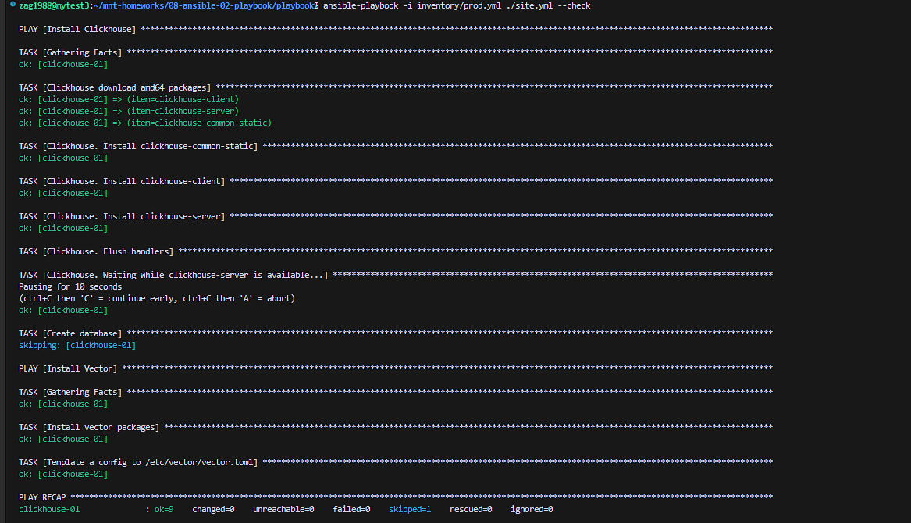

# Домашнее задание к занятию 2 «Работа с Playbook»

## Подготовка к выполнению

1. * Необязательно. Изучите, что такое [ClickHouse](https://www.youtube.com/watch?v=fjTNS2zkeBs) и [Vector](https://www.youtube.com/watch?v=CgEhyffisLY).
2. Создайте свой публичный репозиторий на GitHub с произвольным именем или используйте старый.
3. Скачайте [Playbook](./playbook/) из репозитория с домашним заданием и перенесите его в свой репозиторий.
4. Подготовьте хосты в соответствии с группами из предподготовленного playbook.

## Основная часть

1. Подготовьте свой inventory-файл `prod.yml`
    <details>
    <summary> prod.yaml </summary>

    [prod.yaml](playbook/inventory/prod.yml)
    </details>

2. Допишите playbook: нужно сделать ещё один play, который устанавливает и настраивает [vector](https://vector.dev).
   
```yml
- name: Install Vector
  hosts: clickhouse
  handlers:
    - name: Restart vector service
      ansible.builtin.systemd:
        name: vector
        state: restarted
        enabled: true
      become: true
  tasks:
    - name: Install vector packages
      become: true
      ansible.builtin.apt:
        deb: "https://packages.timber.io/vector/{{ vector_version }}/vector_{{ vector_version }}-1_amd64.deb"
      notify: Restart vector service
    - name: Template a config to /etc/vector/vector.toml
      become: true
      become_user: root
      ansible.builtin.template:
        src: templates/vector.toml
        dest: /etc/vector/vector.toml
        owner: root
        group: root
        mode: "0644"
      notify:
        - Restart vector service 
    
```

3. При создании tasks рекомендую использовать модули: `get_url`, `template`, `unarchive`, `file`.
4. Tasks должны: скачать дистрибутив нужной версии, выполнить распаковку в выбранную директорию, установить vector.
5. Запустите `ansible-lint site.yml` и исправьте ошибки, если они есть.

```shell
    zag1988@mytest3:~/mnt-homeworks/08-ansible-02-playbook/playbook$ ansible-lint site.yml 
    WARNING  Overriding detected file kind 'yaml' with 'playbook' for given positional argument: site.yml
```
6. Попробуйте запустить playbook на этом окружении с флагом `--check`.
    <details>
    <summary> ansible--check</summary>
   
    
    </details>

7. Запустите playbook на `prod.yml` окружении с флагом `--diff`. Убедитесь, что изменения на системе произведены.
8. Повторно запустите playbook с флагом `--diff` и убедитесь, что playbook идемпотентен.
    <details>
    <summary> ansible--diff</summary>
   
    
    </details>

9. Подготовьте README.md-файл по своему playbook. В нём должно быть описано: что делает playbook, какие у него есть параметры и теги. Пример качественной документации ansible playbook по [ссылке](https://github.com/opensearch-project/ansible-playbook).

>Playbook:
     [site.yml](playbook/site.yml)
>Данный playbook предназначен для скачивания дистрибутивов clickhouse и vector, их установки на группе хостов clickhouse, указанных в [prod.yml](playbook/inventory/prod.yml)
>Для установки clickhouse и vector были установлены пакеты версии, указанные в [vars.yml](playbook/group_vars/clickhouse/vars.yml). Из шаблона [templates](playbook/templates) создается конфигурационный файл для загрузки данных в БД. В процессе написания, были спользованы следующие модули:
> - ansible.builtin.service
> - ansible.builtin.get_url
> - ansible.builtin.apt
> - ansible.builtin.pause
> - ansible.builtin.meta
> - ansible.builtin.command
> - ansible.builtin.template
>Так же для удобства управления запуска блоков, были добавлены tag - vector; clickhouse.

10. Готовый playbook выложите в свой репозиторий, поставьте тег `08-ansible-02-playbook` на фиксирующий коммит, в ответ предоставьте ссылку на него.

---

### Как оформить решение задания

Выполненное домашнее задание пришлите в виде ссылки на .md-файл в вашем репозитории.

---
