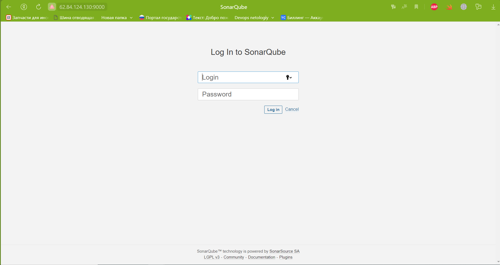
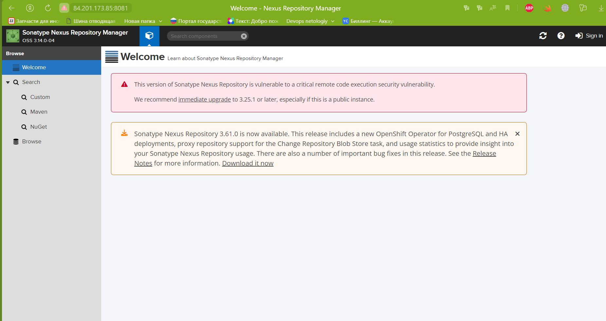
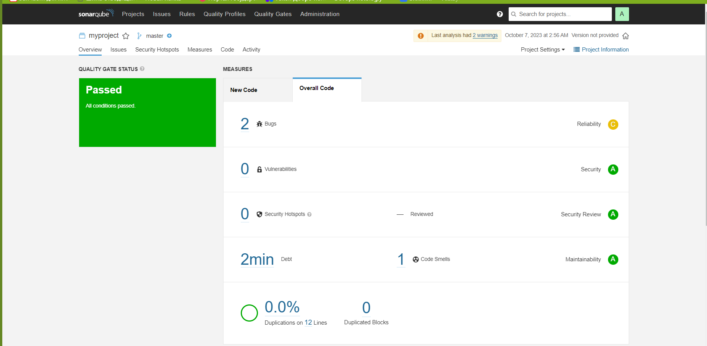
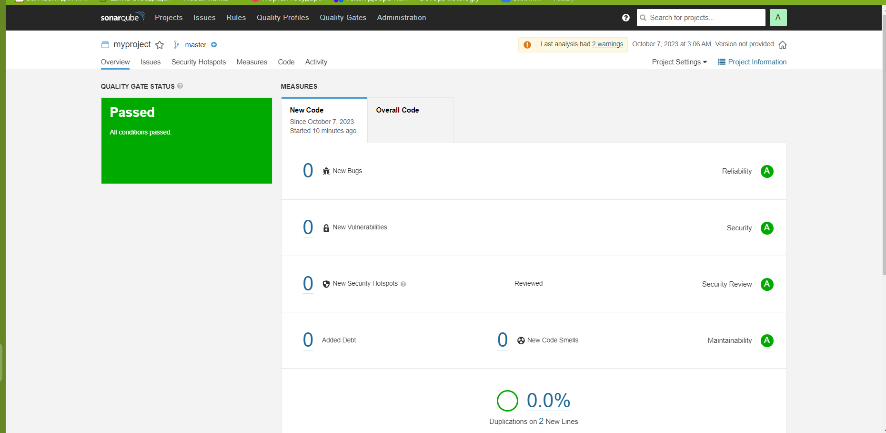

# Домашнее задание к занятию 9 «Процессы CI/CD»

## Подготовка к выполнению

1. Создайте два VM в Yandex Cloud с параметрами: 2CPU 4RAM Centos7 (остальное по минимальным требованиям).
2. Пропишите в [inventory](./infrastructure/inventory/cicd/hosts.yml) [playbook](./infrastructure/site.yml) созданные хосты.
3. Добавьте в [files](./infrastructure/files/) файл со своим публичным ключом (id_rsa.pub). Если ключ называется иначе — найдите таску в плейбуке, которая использует id_rsa.pub имя, и исправьте на своё.
4. Запустите playbook, ожидайте успешного завершения.
5. Проверьте готовность SonarQube через [браузер](http://localhost:9000).

<details>
<summary> Sonar </summary>



</details>

6. Зайдите под admin\admin, поменяйте пароль на свой.
7.  Проверьте готовность Nexus через [бразуер](http://localhost:8081).

<details>
<summary> Nexus </summary>



</details>

8. Подключитесь под admin\admin123, поменяйте пароль, сохраните анонимный доступ.

## Знакомоство с SonarQube

### Основная часть

1. Создайте новый проект, название произвольное.
2. Скачайте пакет sonar-scanner, который вам предлагает скачать SonarQube.
3. Сделайте так, чтобы binary был доступен через вызов в shell (или поменяйте переменную PATH, или любой другой, удобный вам способ).
4. Проверьте `sonar-scanner --version`.

```shell
[zag1988@mytest8 sbin]$ sonar-scanner --version
INFO: Scanner configuration file: /home/zag1988/sonar-scanner-5.0.1.3006-linux/conf/sonar-scanner.properties
INFO: Project root configuration file: NONE
INFO: SonarScanner 5.0.1.3006
INFO: Java 17.0.7 Eclipse Adoptium (64-bit)
INFO: Linux 3.10.0-1160.99.1.el7.x86_64 amd64
```

5. Запустите анализатор против кода из директории [example](./example) с дополнительным ключом `-Dsonar.coverage.exclusions=fail.py`.

<details>
<summary>sonar-scanner</summary>

```shell
[zag1988@mytest8 example]$ sonar-scanner \
>   -Dsonar.projectKey=myproject \
>   -Dsonar.sources=. \
>   -Dsonar.host.url=http://62.84.124.130:9000 \
>   -Dsonar.login=78fd7436feb51337e8e6e8c13cb70491155e5405 \
> -Dsonar.coverage.exclusions=fail.py
INFO: Scanner configuration file: /home/zag1988/sonar-scanner-5.0.1.3006-linux/conf/sonar-scanner.properties
INFO: Project root configuration file: NONE
INFO: SonarScanner 5.0.1.3006
INFO: Java 17.0.7 Eclipse Adoptium (64-bit)
INFO: Linux 3.10.0-1160.99.1.el7.x86_64 amd64
INFO: User cache: /home/zag1988/.sonar/cache
INFO: Analyzing on SonarQube server 9.1.0
INFO: Default locale: "en_US", source code encoding: "UTF-8" (analysis is platform dependent)
INFO: Load global settings
INFO: Load global settings (done) | time=72ms
INFO: Server id: 9CFC3560-AYsCnG1i19Sh0Z1aS8tS
INFO: User cache: /home/zag1988/.sonar/cache
INFO: Load/download plugins
INFO: Load plugins index
INFO: Load plugins index (done) | time=29ms
INFO: Load/download plugins (done) | time=119ms
INFO: Process project properties
INFO: Process project properties (done) | time=9ms
INFO: Execute project builders
INFO: Execute project builders (done) | time=1ms
INFO: Project key: myproject
INFO: Base dir: /home/zag1988/example
INFO: Working dir: /home/zag1988/example/.scannerwork
INFO: Load project settings for component key: 'myproject'
INFO: Load project settings for component key: 'myproject' (done) | time=17ms
INFO: Load quality profiles
INFO: Load quality profiles (done) | time=86ms
INFO: Load active rules
INFO: Load active rules (done) | time=1287ms
WARN: SCM provider autodetection failed. Please use "sonar.scm.provider" to define SCM of your project, or disable the SCM Sensor in the project settings.
INFO: Indexing files...
INFO: Project configuration:
INFO:   Excluded sources for coverage: fail.py
INFO: 1 file indexed
INFO: Quality profile for py: Sonar way
INFO: ------------- Run sensors on module myproject
INFO: Load metrics repository
INFO: Load metrics repository (done) | time=39ms
INFO: Sensor Python Sensor [python]
WARN: Your code is analyzed as compatible with python 2 and 3 by default. This will prevent the detection of issues specific to python 2 or python 3. You can get a more precise analysis by setting a python version in your configuration via the parameter "sonar.python.version"
INFO: Starting global symbols computation
INFO: 1 source file to be analyzed
INFO: Load project repositories
INFO: Load project repositories (done) | time=17ms
INFO: 1/1 source file has been analyzed
INFO: Starting rules execution
INFO: 1 source file to be analyzed
INFO: 1/1 source file has been analyzed
INFO: Sensor Python Sensor [python] (done) | time=841ms
INFO: Sensor Cobertura Sensor for Python coverage [python]
INFO: Sensor Cobertura Sensor for Python coverage [python] (done) | time=8ms
INFO: Sensor PythonXUnitSensor [python]
INFO: Sensor PythonXUnitSensor [python] (done) | time=1ms
INFO: Sensor CSS Rules [cssfamily]
INFO: No CSS, PHP, HTML or VueJS files are found in the project. CSS analysis is skipped.
INFO: Sensor CSS Rules [cssfamily] (done) | time=1ms
INFO: Sensor JaCoCo XML Report Importer [jacoco]
INFO: 'sonar.coverage.jacoco.xmlReportPaths' is not defined. Using default locations: target/site/jacoco/jacoco.xml,target/site/jacoco-it/jacoco.xml,build/reports/jacoco/test/jacocoTestReport.xml
INFO: No report imported, no coverage information will be imported by JaCoCo XML Report Importer
INFO: Sensor JaCoCo XML Report Importer [jacoco] (done) | time=13ms
INFO: Sensor C# Project Type Information [csharp]
INFO: Sensor C# Project Type Information [csharp] (done) | time=1ms
INFO: Sensor C# Analysis Log [csharp]
INFO: Sensor C# Analysis Log [csharp] (done) | time=9ms
INFO: Sensor C# Properties [csharp]
INFO: Sensor C# Properties [csharp] (done) | time=0ms
INFO: Sensor JavaXmlSensor [java]
INFO: Sensor JavaXmlSensor [java] (done) | time=1ms
INFO: Sensor HTML [web]
INFO: Sensor HTML [web] (done) | time=2ms
INFO: Sensor VB.NET Project Type Information [vbnet]
INFO: Sensor VB.NET Project Type Information [vbnet] (done) | time=1ms
INFO: Sensor VB.NET Analysis Log [vbnet]
INFO: Sensor VB.NET Analysis Log [vbnet] (done) | time=8ms
INFO: Sensor VB.NET Properties [vbnet]
INFO: Sensor VB.NET Properties [vbnet] (done) | time=1ms
INFO: ------------- Run sensors on project
INFO: Sensor Zero Coverage Sensor
INFO: Sensor Zero Coverage Sensor (done) | time=1ms
INFO: SCM Publisher No SCM system was detected. You can use the 'sonar.scm.provider' property to explicitly specify it.
INFO: CPD Executor Calculating CPD for 1 file
INFO: CPD Executor CPD calculation finished (done) | time=8ms
INFO: Analysis report generated in 79ms, dir size=103.0 kB
INFO: Analysis report compressed in 19ms, zip size=14.1 kB
INFO: Analysis report uploaded in 19ms
INFO: ANALYSIS SUCCESSFUL, you can browse http://62.84.124.130:9000/dashboard?id=myproject
INFO: Note that you will be able to access the updated dashboard once the server has processed the submitted analysis report
INFO: More about the report processing at http://62.84.124.130:9000/api/ce/task?id=AYsHa-wb19Sh0Z1aTByz
INFO: Analysis total time: 4.064 s
INFO: ------------------------------------------------------------------------
INFO: EXECUTION SUCCESS
INFO: ------------------------------------------------------------------------
INFO: Total time: 5.011s
INFO: Final Memory: 7M/34M
INFO: ------------------------------------------------------------------------
```
</details>


6. Посмотрите результат в интерфейсе.

<details>
<summary> Bugs </summary>



</details>

7. Исправьте ошибки, которые он выявил, включая warnings.
8. Запустите анализатор повторно — проверьте, что QG пройдены успешно.
9. Сделайте скриншот успешного прохождения анализа, приложите к решению ДЗ.

<details>
<summary> SUCCESS </summary>



</details>

## Знакомство с Nexus

### Основная часть

1. В репозиторий `maven-public` загрузите артефакт с GAV-параметрами:

 *    groupId: netology;
 *    artifactId: java;
 *    version: 8_282;
 *    classifier: distrib;
 *    type: tar.gz.
   
2. В него же загрузите такой же артефакт, но с version: 8_102.
3. Проверьте, что все файлы загрузились успешно.
4. В ответе пришлите файл `maven-metadata.xml` для этого артефекта.

```xml
<?xml version="1.0" encoding="UTF-8"?>
<metadata modelVersion="1.1.0">
  <groupId>netology</groupId>
  <artifactId>java</artifactId>
  <versioning>
    <latest>8_282</latest>
    <release>8_282</release>
    <versions>
      <version>8_102</version>
      <version>8_282</version>
    </versions>
    <lastUpdated>20231006042650</lastUpdated>
  </versioning>
</metadata>
```

### Знакомство с Maven

### Подготовка к выполнению

1. Скачайте дистрибутив с [maven](https://maven.apache.org/download.cgi).
2. Разархивируйте, сделайте так, чтобы binary был доступен через вызов в shell (или поменяйте переменную PATH, или любой другой, удобный вам способ).
3. Удалите из `apache-maven-<version>/conf/settings.xml` упоминание о правиле, отвергающем HTTP- соединение — раздел mirrors —> id: my-repository-http-unblocker.
4. Проверьте `mvn --version`.

```shell
[zag1988@mytest6 bin]$ mvn --version
Apache Maven 3.9.5 (57804ffe001d7215b5e7bcb531cf83df38f93546)
Maven home: /home/zag1988/apache-maven-3.9.5
Java version: 1.8.0_382, vendor: Red Hat, Inc., runtime: /usr/lib/jvm/java-1.8.0-openjdk-1.8.0.382.b05-1.el7_9.x86_64/jre
Default locale: en_US, platform encoding: UTF-8
OS name: "linux", version: "3.10.0-1160.99.1.el7.x86_64", arch: "amd64", family: "unix"
```
5. Заберите директорию [mvn](./mvn) с pom.


### Основная часть

1. Поменяйте в `pom.xml` блок с зависимостями под ваш артефакт из первого пункта задания для Nexus (java с версией 8_282).
2. Запустите команду `mvn package` в директории с `pom.xml`, ожидайте успешного окончания.

<details>
<summary> mvn package </summary>

```shell
[zag1988@mytest6 mvn]$ mvn package
[INFO] Scanning for projects...
[INFO] 
[INFO] --------------------< com.netology.app:simple-app >---------------------
[INFO] Building simple-app 1.0-SNAPSHOT
[INFO]   from pom.xml
[INFO] --------------------------------[ jar ]---------------------------------
Downloading from my-repo: http://158.160.44.98:8081/repository/maven-releases/netology/java/8_282/java-8_282.pom
Downloading from central: https://repo.maven.apache.org/maven2/netology/java/8_282/java-8_282.pom
[WARNING] The POM for netology:java:tar.gz:distrib:8_282 is missing, no dependency information available
[INFO] 
[INFO] --- resources:3.3.1:resources (default-resources) @ simple-app ---
[WARNING] Using platform encoding (UTF-8 actually) to copy filtered resources, i.e. build is platform dependent!
[INFO] skip non existing resourceDirectory /home/zag1988/mvn/src/main/resources
[INFO] 
[INFO] --- compiler:3.11.0:compile (default-compile) @ simple-app ---
[INFO] No sources to compile
[INFO] 
[INFO] --- resources:3.3.1:testResources (default-testResources) @ simple-app ---
[WARNING] Using platform encoding (UTF-8 actually) to copy filtered resources, i.e. build is platform dependent!
[INFO] skip non existing resourceDirectory /home/zag1988/mvn/src/test/resources
[INFO] 
[INFO] --- compiler:3.11.0:testCompile (default-testCompile) @ simple-app ---
[INFO] No sources to compile
[INFO] 
[INFO] --- surefire:3.1.2:test (default-test) @ simple-app ---
[INFO] No tests to run.
[INFO] 
[INFO] --- jar:3.3.0:jar (default-jar) @ simple-app ---
[WARNING] JAR will be empty - no content was marked for inclusion!
[INFO] Building jar: /home/zag1988/mvn/target/simple-app-1.0-SNAPSHOT.jar
[INFO] ------------------------------------------------------------------------
[INFO] BUILD SUCCESS
[INFO] ------------------------------------------------------------------------
[INFO] Total time:  7.507 s
[INFO] Finished at: 2023-10-07T01:26:32Z
[INFO] ------------------------------------------------------------------------
```
</details>

3. Проверьте директорию `~/.m2/repository/`, найдите ваш артефакт.

```shell
zag1988@mytest6 ~]$ ls -l ~/.m2/repository/netology/java/8_282/
total 832
-rw-rw-r--. 1 zag1988 zag1988 836816 Oct  6 04:25 java-8_282-distrib.tar.gz
-rw-rw-r--. 1 zag1988 zag1988     40 Oct  6 22:30 java-8_282-distrib.tar.gz.sha1
-rw-rw-r--. 1 zag1988 zag1988    880 Oct  7 01:26 java-8_282.pom.lastUpdated
-rw-rw-r--. 1 zag1988 zag1988    175 Oct  6 22:30 _remote.repositories
```
4. В ответе пришлите исправленный файл `pom.xml`.

[pom.xml](mvn/pom.xml)
---

### Как оформить решение задания

Выполненное домашнее задание пришлите в виде ссылки на .md-файл в вашем репозитории.

---
