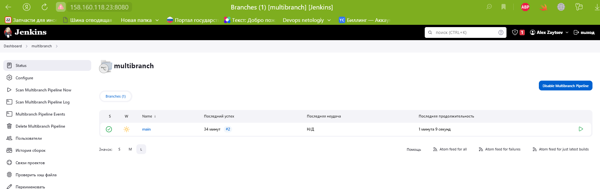
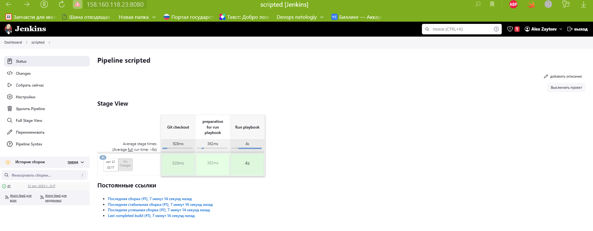

# Домашнее задание к занятию 10 «Jenkins»

## Подготовка к выполнению

1. Создать два VM: для jenkins-master и jenkins-agent.
2. Установить Jenkins при помощи [playbook](./infrastructure/ubuntu/Ubuntujenkins.yml).
3. Запустить и проверить работоспособность.

<details>
<summary> Nodes </summary>


</details>

4. Сделать первоначальную настройку.

## Основная часть

1. Сделать Freestyle Job, который будет запускать `molecule test` из любого вашего репозитория с ролью.

<details>
<summary> Freestyle Job </summary>


</details>

2. Сделать Declarative Pipeline Job, который будет запускать `molecule test` из любого вашего репозитория с ролью.


<details>
<summary> Declarative Pipeline Job </summary>


</details>

3. Перенести Declarative Pipeline в репозиторий в файл [Jenkinsfile](https://github.com/Midzaru2011/vector-role/blob/main/Jenkinsfile).
4. Создать Multibranch Pipeline на запуск `Jenkinsfile` из репозитория.

<details>
<summary> Multibranch Pipeline </summary>

 


</details>

5. Создать Scripted Pipeline, наполнить его скриптом из [pipeline](./pipeline).
6. Внести необходимые изменения, чтобы Pipeline запускал `ansible-playbook` без флагов `--check --diff`, если не установлен параметр при запуске джобы (prod_run = True). По умолчанию параметр имеет значение False и запускает прогон с флагами `--check --diff`.

<details>
<summary> ScriptedJenkinsfile </summary>



```shell
Started by user Alex Zaytsev
[Pipeline] Start of Pipeline
[Pipeline] node
Running on slave in /opt/jenkins_agent/workspace/scripted
[Pipeline] {
[Pipeline] stage
[Pipeline] { (Git checkout)
[Pipeline] git
The recommended git tool is: NONE
Warning: CredentialId "git" could not be found.
Fetching changes from the remote Git repository
Checking out Revision 20bd8d945340bb742acdd9e8c1a8fb5b73cc1700 (refs/remotes/origin/master)
Commit message: "Merge branch 'master' of https://github.com/aragastmatb/example-playbook"
 > git rev-parse --resolve-git-dir /opt/jenkins_agent/workspace/scripted/.git # timeout=10
 > git config remote.origin.url https://github.com/aragastmatb/example-playbook.git # timeout=10
Fetching upstream changes from https://github.com/aragastmatb/example-playbook.git
 > git --version # timeout=10
 > git --version # 'git version 2.34.1'
 > git fetch --tags --force --progress -- https://github.com/aragastmatb/example-playbook.git +refs/heads/*:refs/remotes/origin/* # timeout=10
 > git rev-parse refs/remotes/origin/master^{commit} # timeout=10
 > git config core.sparsecheckout # timeout=10
 > git checkout -f 20bd8d945340bb742acdd9e8c1a8fb5b73cc1700 # timeout=10
 > git branch -a -v --no-abbrev # timeout=10
 > git branch -D master # timeout=10
 > git checkout -b master 20bd8d945340bb742acdd9e8c1a8fb5b73cc1700 # timeout=10
 > git rev-list --no-walk 20bd8d945340bb742acdd9e8c1a8fb5b73cc1700 # timeout=10
[Pipeline] }
[Pipeline] // stage
[Pipeline] stage
[Pipeline] { (preparation for run playbook)
[Pipeline] sh
+ sudo mkdir -p /opt/jdk/openjdk-11
[Pipeline] }
[Pipeline] // stage
[Pipeline] stage
[Pipeline] { (Run playbook)
[Pipeline] sh
+ sudo ansible-playbook site.yml -i inventory/prod.yml

PLAY [Install Java] ************************************************************

TASK [Gathering Facts] *********************************************************
ok: [localhost]

TASK [java : Upload .tar.gz file containing binaries from local storage] *******
skipping: [localhost]

TASK [java : Upload .tar.gz file conaining binaries from remote storage] *******
ok: [localhost]

TASK [java : Ensure installation dir exists] ***********************************
ok: [localhost]

TASK [java : Extract java in the installation directory] ***********************
skipping: [localhost]

TASK [java : Export environment variables] *************************************
ok: [localhost]

PLAY RECAP *********************************************************************
localhost                  : ok=4    changed=0    unreachable=0    failed=0    skipped=2    rescued=0    ignored=0   

[Pipeline] }
[Pipeline] // stage
[Pipeline] }
[Pipeline] // node
[Pipeline] End of Pipeline
Finished: SUCCESS

```

</details>


7. Проверить работоспособность, исправить ошибки, исправленный Pipeline вложить в репозиторий в файл [ScriptedJenkinsfile](https://github.com/Midzaru2011/vector-role/blob/main/ScriptedJenkinsfile).

8. Отправить ссылку на репозиторий с ролью и [Declarative Pipeline](https://github.com/Midzaru2011/vector-role/blob/main/Jenkinsfile) и [Scripted Pipeline](https://github.com/Midzaru2011/vector-role/blob/main/ScriptedJenkinsfile).


## Необязательная часть

1. Создать скрипт на groovy, который будет собирать все Job, завершившиеся хотя бы раз неуспешно. Добавить скрипт в репозиторий с решением и названием `AllJobFailure.groovy`.
2. Создать Scripted Pipeline так, чтобы он мог сначала запустить через Yandex Cloud CLI необходимое количество инстансов, прописать их в инвентори плейбука и после этого запускать плейбук. Мы должны при нажатии кнопки получить готовую к использованию систему.

---

### Как оформить решение задания

Выполненное домашнее задание пришлите в виде ссылки на .md-файл в вашем репозитории.

---
