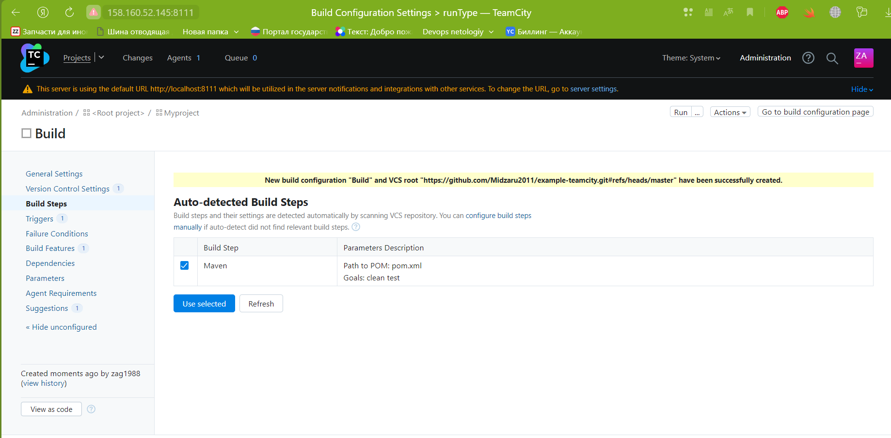
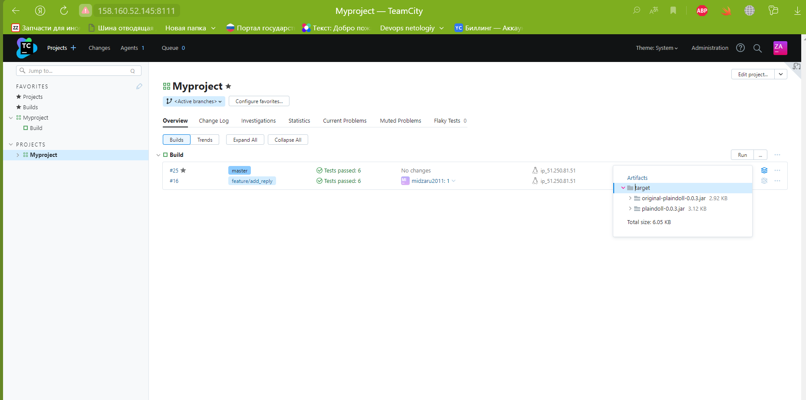

# Домашнее задание к занятию 11 «Teamcity»

## Подготовка к выполнению

1. В Yandex Cloud создайте новый инстанс (4CPU4RAM) на основе образа `jetbrains/teamcity-server`.
2. Дождитесь запуска teamcity, выполните первоначальную настройку.
3. Создайте ещё один инстанс (2CPU4RAM) на основе образа `jetbrains/teamcity-agent`. Пропишите к нему переменную окружения `SERVER_URL: "http://<teamcity_url>:8111"`.
4. Авторизуйте агент.
5. Сделайте fork [репозитория](https://github.com/aragastmatb/example-teamcity).
6. Создайте VM (2CPU4RAM) и запустите [playbook](./infrastructure).

## Основная часть

1. Создайте новый проект в teamcity на основе fork.

<details>
<summary> New project </summary>


</details>

2. Сделайте autodetect конфигурации.

<details>
<summary> autodetect </summary>



</details>

3. Сохраните необходимые шаги, запустите первую сборку master.

<details>
<summary> build master </summary>


</details>


4. Поменяйте условия сборки: если сборка по ветке `master`, то должен происходит `mvn clean deploy`, иначе `mvn clean test`.

<details>
<summary> add build steps </summary>


</details>

5. Для deploy будет необходимо загрузить [settings.xml](teamcity/settings.xml) в набор конфигураций maven у teamcity, предварительно записав туда креды для подключения к nexus.
6. В pom.xml необходимо поменять ссылки на репозиторий и nexus.
7. Запустите сборку по master, убедитесь, что всё прошло успешно и артефакт появился в nexus.

<details>
<summary> start build and add distributive to nexus </summary>


</details>

8. Мигрируйте `build configuration` в репозиторий.

<details>
<summary> start build and add distributive to nexus </summary>


</details>

9. Создайте отдельную ветку `feature/add_reply` в репозитории.
10. Напишите новый метод для класса Welcomer: метод должен возвращать произвольную реплику, содержащую слово `hunter`.


<details>
<summary> add method Hunter </summary>

```java
    
package plaindoll;

public class Welcomer{
	public String sayWelcome() {
		return "Welcome home, good hunter. What is it your desire?";
	}
	public String sayFarewell() {
		return "Farewell, good hunter. May you find your worth in waking world.";
	}
	public String sayNeedGold(){
		return "Not enough gold";
	}
	public String saySome(){
		return "something in the way";
	}
	public String sayHunter(){
		return "Hi, Hunter!";
	}
}

```
</details>

11. Дополните тест для нового метода на поиск слова `hunter` в новой реплике.

<details>
<summary> add method Hunter to test  </summary>

```java
package plaindoll;

import static org.hamcrest.CoreMatchers.containsString;
import static org.junit.Assert.*;

import org.junit.Test;

public class WelcomerTest {
	
	private Welcomer welcomer = new Welcomer();

	@Test
	public void welcomerSaysWelcome() {
		assertThat(welcomer.sayWelcome(), containsString("Welcome"));
	}
	@Test
	public void welcomerSaysFarewell() {
		assertThat(welcomer.sayFarewell(), containsString("Farewell"));
	}
	@Test
	public void welcomerSaysHunter() {
		assertThat(welcomer.sayWelcome(), containsString("hunter"));
		assertThat(welcomer.sayFarewell(), containsString("hunter"));
	}
	@Test
	public void welcomerSaysSilver(){
		assertThat(welcomer.sayNeedGold(), containsString("gold"));
	}
	@Test
	public void welcomerSaysSomething(){
		assertThat(welcomer.saySome(), containsString("something"));
	}
	@Test
	public void midzaru2011SaysHunter(){
		assertThat(welcomer.sayHunter(), containsString("Hunter"));
	}
}
```


</details>

12. Сделайте push всех изменений в новую ветку репозитория.
13. Убедитесь, что сборка самостоятельно запустилась, тесты прошли успешно.

<details>
<summary> build feature/add_reply  </summary>

 


</details>

14. Внесите изменения из произвольной ветки `feature/add_reply` в `master` через [Merge](https://github.com/Midzaru2011/example-teamcity/pull/2).
15. Убедитесь, что нет собранного артефакта в сборке по ветке `master`.
16. Настройте конфигурацию так, чтобы она собирала `.jar` в артефакты сборки.
17. Проведите повторную сборку мастера, убедитесь, что сбора прошла успешно и артефакты собраны.

<details>
<summary> artifacts </summary>



</details>

18. Проверьте, что конфигурация в репозитории содержит все настройки конфигурации из teamcity.
19. В ответе пришлите ссылку на репозиторий. [Myproject](https://github.com/Midzaru2011/example-teamcity)

---

### Как оформить решение задания

Выполненное домашнее задание пришлите в виде ссылки на .md-файл в вашем репозитории.

---
